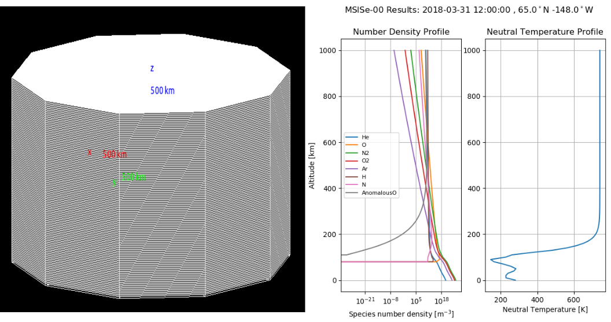
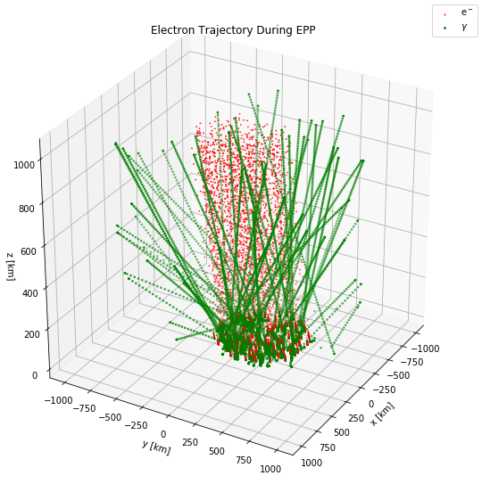
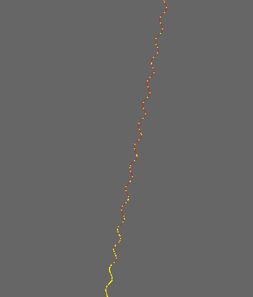
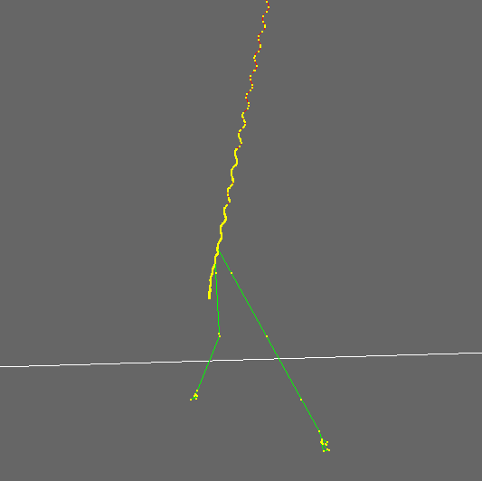
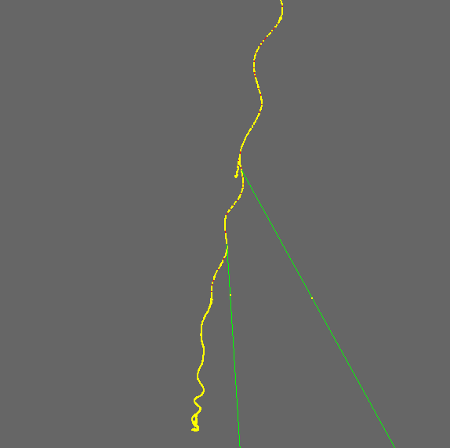

# Geant4_Atmospheric_EPP

This Geant project aims to simulate energetic particle precipitation (EPP) through the atmosphere.

### Simulation space and MSIS atmospheric profiles

(Left) The "column of atmosphere" simulation space in which charged particles or photons of interest are inject at the top. (Right) MSIS atmospheric profiles of the consituents of the column.

### Energetic particle precipitation simulation
 
Electron and photon positions over time, showing the precipitating column of electrons and the photon production below 100 km altitude.

### Electron gyromotion

### Bremsstrahlung photon production

### Electron mirroring 

